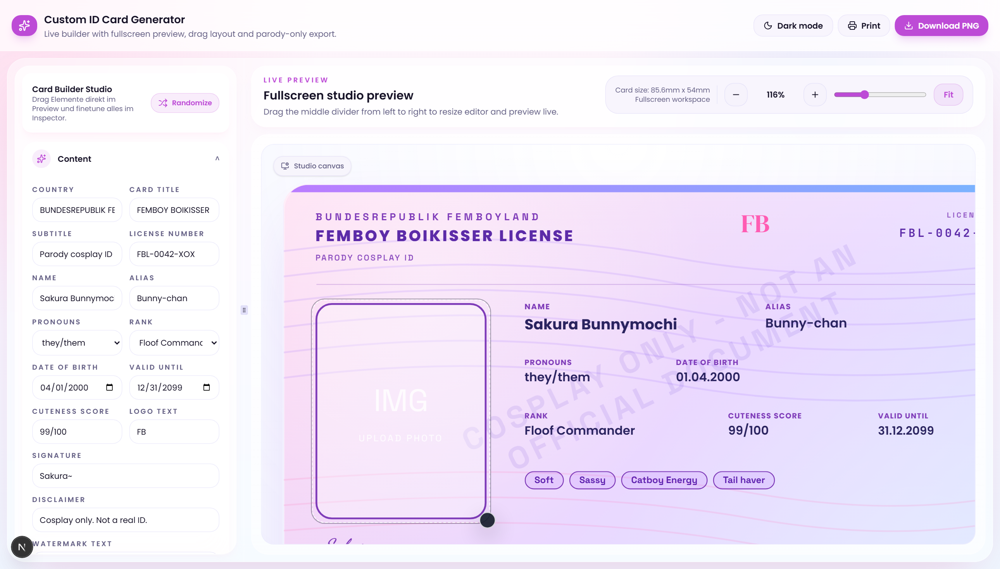
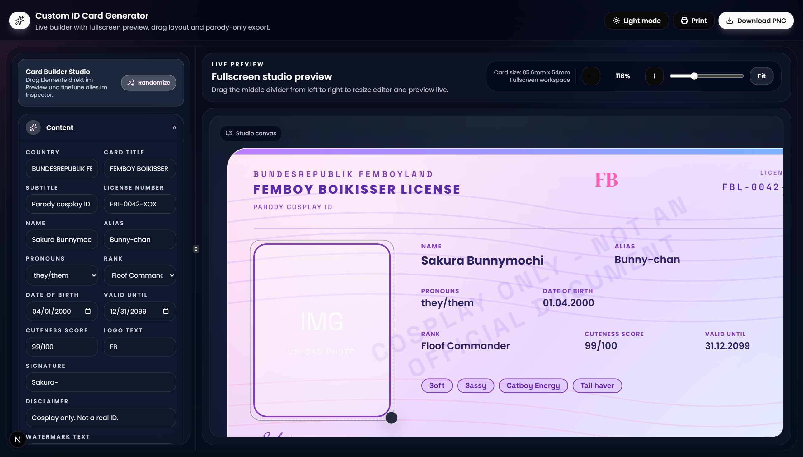
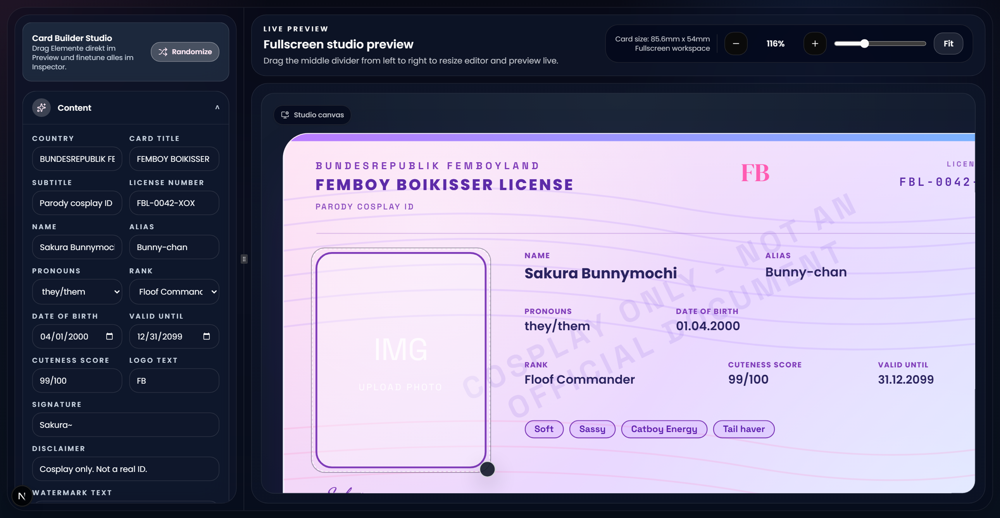

# Custom Cosplay ID Card Generator

<p align="center">
  A polished, client-side card builder for fictional cosplay ID cards with live editing, drag-and-drop layout control, theme customization, PNG export, and print-ready output.
</p>

<p align="center">
  
  
  
  
  
</p>

<p align="center">
  
  
  
  
</p>

---

## Overview

Custom ID Card Generator is a fullscreen web studio for designing clearly fictional parody ID cards. It focuses on a responsive editing workflow, direct visual feedback, and extensive customization without relying on any backend services.

The app is intentionally built for parody and cosplay use only. It includes visible disclaimer content and watermarking to keep the output clearly non-official.

## Preview

### Light studio



### Dark studio



### Workspace view



## Why this project

- Fullscreen editing experience with a resizable studio layout
- Live preview that updates while the form and inspector change
- Layer-based customization for text, fields, images, shapes, and chips
- Direct canvas interaction for selecting and moving elements
- Theme presets plus manual color tuning
- Reliable PNG export and print flow in credit-card dimensions
- Modern React architecture with all state handled on the client

## Core capabilities

### Builder workflow

- Editable content fields for title, name, alias, pronouns, dates, rank, score, traits, logo text, watermark text, and disclaimer text
- Upload support for portrait and emblem images
- Randomizer for fun placeholder content
- Watermark toggle for preview and export

### Layer system

- Add new `text`, `field`, `image`, `shape`, and `chips` layers
- Move, resize, hide, lock, and reorder layers
- Bind layers to content fields or use standalone custom values
- Control typography, spacing, colors, backgrounds, borders, opacity, and radius settings

### Visual customization

- Preset themes: `pastel`, `dark`, and `neon`
- Manual gradient and decorative color control
- Dark mode and light mode for the application shell
- Fullscreen preview pane with zoom controls

### Output

- PNG export at 2x scale
- Print view optimized for `85.6mm x 54mm`
- Export and print rendering isolated from the main shell for more reliable output

## Safety note

This generator is for fictional cosplay props only. It must not be used to create, simulate, or present anything as a real identity document. The project intentionally uses parody framing, disclaimers, and watermark text to reduce confusion with official IDs.

## Tech stack

| Area | Stack |
| --- | --- |
| Framework | Next.js 16 |
| UI | React 19 |
| Language | TypeScript |
| Styling | Tailwind CSS 4 |
| Components | Radix UI primitives |
| Export | `html2canvas` |

## Quick start

### Requirements

- Node.js 18 or newer
- npm

### Installation

```bash
npm install
```

### Development

```bash
npm run dev
```

Open [http://127.0.0.1:3000](http://127.0.0.1:3000).

### Production build

```bash
npm run build
npm run start
```

## Available scripts

| Script | Purpose |
| --- | --- |
| `npm run dev` | Start the local development server |
| `npm run build` | Create a production build |
| `npm run start` | Run the production server |
| `npm run lint` | Run ESLint if installed in the environment |

## Project structure

```text
app/                    Next.js app router entrypoints
components/             Editor, card renderer, providers, and UI primitives
docs/screenshots/       Repository screenshots used in the README
hooks/                  Shared React hooks
lib/                    Card models, presets, layer factories, and utilities
public/                 Static assets
styles/                 Additional styling assets
```

## Architecture

### `app/page.tsx`

Owns the main studio shell, including layout, theme toggle, zoom controls, preview resizing, PNG export, and print flow.

### `components/card-editor.tsx`

Contains the editing workspace, content controls, theme customization, upload flows, layer stack management, and layer inspector panels.

### `components/id-card.tsx`

Renders the card surface itself and handles interactive layer selection in the live preview.

### `lib/card-types.ts`

Defines the card data model, themes, layer types, default content, and helper factories used throughout the builder.

## Customization model

The app uses a typed layer system so new visual elements can be added and edited without introducing backend complexity. Each layer carries its own position, size, style, visibility, locking state, and content binding behavior.

Supported layer types:

- `text`
- `field`
- `image`
- `shape`
- `chips`

## Verification

The current repository state was verified with:

```bash
npm run build
npx tsc --noEmit
```

## License

This project is licensed under the MIT License. See [LICENSE](LICENSE) for details.
